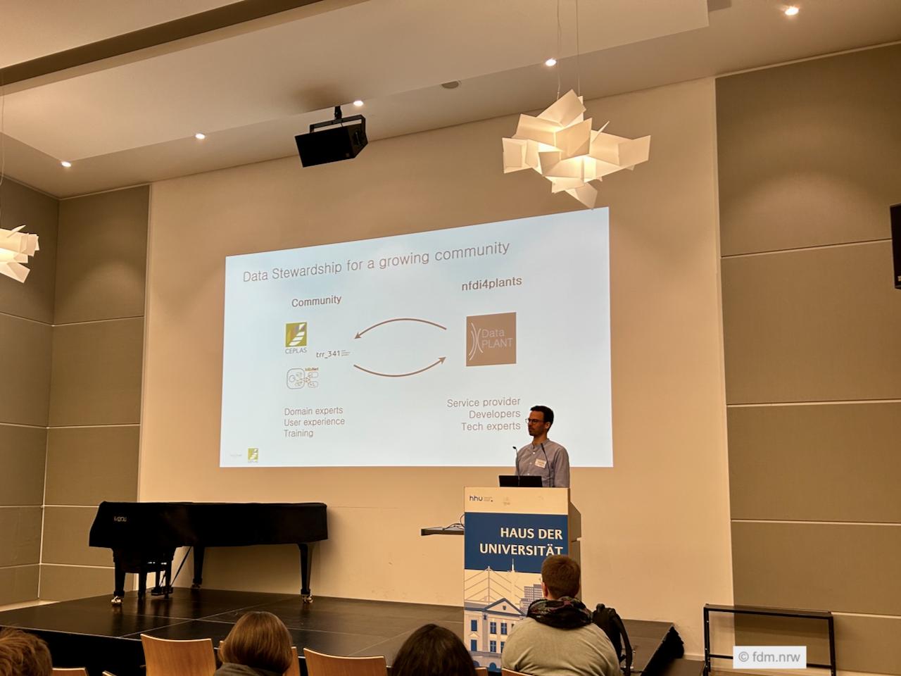

DataPLANT participated in the fdm.nrw Werkstatt, a community-driven workshop held March 23–25, 2026, at Heinrich Heine University in Düsseldorf. Organized by fdm.nrw in collaboration with DataPLANT, [NFDI4BIOIMAGE](https://nfdi4bioimage.de/), and [CEPLAS](https://www.ceplas.eu/en/), the event brought together data stewards, developers, and researchers to explore research data management tools and practices.

The workshop featured hands-on sessions with a range of RDM tools and services, including [ARCitect](https://github.com/nfdi4plants/ARCitect), [elab2ARC](https://github.com/nfdi4plants/elab2arc), [OMERO](https://www.openmicroscopy.org/omero/), [elabFTW](https://www.elabftw.net), and [Coscine](http://coscine.nrw/). Participants had opportunities to discuss tool integration and coordination efforts across fdm.nrw and the broader NFDI landscape.

[Sabrina Zander](https://nfdi4plants.org/member/sabrina-zander) (MibiNet) [Yaser Alashloo](https://nfdi4plants.org/member/yaser-alashloo/) (CEPLAS) hosted a hands-on session "Turning Research Projects into FAIR Digital Objects: a Hands-On Introduction to Annotated Research Contexts (ARCs) and ELN integration" where they introduced participants to the ARC concept and demonstrated how to use ARCitect and elab2ARC for creating and managing ARCs.

In another hands-on session, [Saskia Hiltemann](https://nfdi4plants.org/member/saskia-hiltemann/) provided "An Introduction to the Galaxy platform for FAIR data analysis".

[Dominik Brilhaus](https://nfdi4plants.org/member/dominik-brilhaus/) (CEPLAS) presented the "DataPLANT Tools & Services – And how they support community RDM" 

